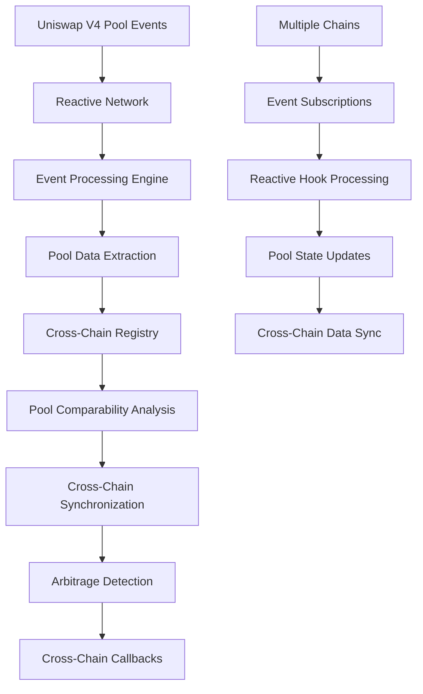

# Reactive Hook Integration Architecture for Cross-Chain Data Sharing

## Overview

This document outlines the architecture for integrating Reactive Network components into Uniswap v4 hooks to enable cross-chain data sharing and real-time pool monitoring across multiple blockchain networks.

## System Architecture

### 1. Core Components

#### **Reactive Hook Base Contract**
- **Purpose**: Base contract that combines Uniswap v4 hook functionality with Reactive Network event processing
- **Key Features**:
  - Implements both `IHooks` and `IReactive` interfaces
  - Manages cross-chain event subscriptions
  - Processes pool events and triggers reactive callbacks
  - Handles cross-chain data synchronization

#### **Cross-Chain Pool Registry**
- **Purpose**: Centralized registry for managing pool data across multiple chains
- **Key Features**:
  - Maps `PoolManagerKey` (chainId + poolManager address) to pool collections
  - Tracks pool comparability across chains
  - Manages cross-chain pool synchronization
  - Stores pool metadata and metrics

#### **Event Processing Engine**
- **Purpose**: Processes and routes events from multiple chains
- **Key Features**:
  - Subscribes to Uniswap v4 events across chains
  - Processes `Initialize`, `ModifyLiquidity`, `Swap`, and `Donate` events
  - Extracts pool data and triggers cross-chain updates
  - Manages event filtering and routing

#### **Cross-Chain Data Synchronizer**
- **Purpose**: Synchronizes pool data and metrics across chains
- **Key Features**:
  - Maintains consistent state across multiple chains
  - Handles cross-chain arbitrage detection
  - Manages price and liquidity synchronization
  - Triggers cross-chain callbacks

### 2. Integration Patterns

#### **Reactive Hook Pattern**
```solidity
contract ReactiveUniswapV4Hook is IHooks, AbstractReactive {
    // Hook implementations
    function beforeInitialize(...) external returns (bytes4) { ... }
    function afterInitialize(...) external returns (bytes4) { ... }
    function beforeSwap(...) external returns (bytes4, BeforeSwapDelta, uint24) { ... }
    function afterSwap(...) external returns (bytes4, int128) { ... }
    
    // Reactive event processing
    function react(LogRecord calldata log) external vmOnly { ... }
    
    // Cross-chain data management
    function syncPoolData(PoolKey calldata key, bytes calldata data) external { ... }
}
```

#### **Cross-Chain Event Subscription Pattern**
```solidity
// Subscribe to events across multiple chains
service.subscribe(
    CHAIN_ID_ETHEREUM,
    poolManagerAddress,
    INITIALIZE_TOPIC_0,
    REACTIVE_IGNORE,
    REACTIVE_IGNORE,
    REACTIVE_IGNORE
);

service.subscribe(
    CHAIN_ID_POLYGON,
    poolManagerAddress,
    SWAP_TOPIC_0,
    REACTIVE_IGNORE,
    REACTIVE_IGNORE,
    REACTIVE_IGNORE
);
```

#### **Pool Comparability Pattern**
```solidity
struct PoolComparability {
    bool isComparable;
    uint256 confidence;
    PoolKey[] comparablePools;
    mapping(uint256 => PoolKey) chainPools; // chainId => PoolKey
}
```

### 3. Data Flow Architecture



### 4. Key Features

#### **Real-Time Cross-Chain Monitoring**
- Monitor pool events across multiple chains simultaneously
- Detect arbitrage opportunities in real-time
- Track pool liquidity and price changes
- Maintain synchronized pool state

#### **Pool Comparability Engine**
- Compare pools across chains based on:
  - Currency pairs (currency0, currency1)
  - Tick spacing
  - Fee structures
  - Hook compatibility
- Calculate comparability confidence scores
- Identify optimal arbitrage paths

#### **Cross-Chain Data Sharing**
- Share pool data and metrics across chains
- Synchronize pool state changes
- Maintain consistent cross-chain registry
- Enable cross-chain pool discovery

#### **Event-Driven Architecture**
- Reactive event processing using Reactive Network
- Real-time event subscriptions
- Efficient event filtering and routing
- Scalable cross-chain event handling

### 5. Implementation Strategy

#### **Phase 1: Core Infrastructure**
1. Implement `ReactiveUniswapV4Hook` base contract
2. Create cross-chain pool registry
3. Build event processing engine
4. Implement basic pool comparability logic

#### **Phase 2: Cross-Chain Integration**
1. Add multi-chain event subscriptions
2. Implement cross-chain data synchronization
3. Build arbitrage detection system
4. Create cross-chain callback mechanisms

#### **Phase 3: Advanced Features**
1. Add advanced pool analytics
2. Implement MEV protection mechanisms
3. Create automated arbitrage execution
4. Add machine learning-based pool analysis

### 6. Security Considerations

#### **Access Control**
- Reactive Network only execution (`rnOnly` modifier)
- VM-only execution for reactive callbacks (`vmOnly` modifier)
- Authorized sender validation
- Cross-chain callback verification

#### **Event Validation**
- Comprehensive LogRecord validation
- Event signature verification
- Data integrity checks
- Cross-chain event authenticity

#### **Pool Data Integrity**
- Pool comparability validation
- Cross-chain data consistency checks
- Arbitrage opportunity verification
- State synchronization validation

### 7. Performance Optimization

#### **Gas Efficiency**
- Pure functions for pool comparison
- Library-based implementations
- Optimized event processing
- Efficient cross-chain data structures

#### **Scalability**
- Batch event processing
- Efficient event filtering
- Optimized cross-chain synchronization
- Scalable registry management

### 8. Deployment Strategy

#### **Multi-Chain Deployment**
1. Deploy reactive contracts on Reactive Network
2. Deploy hook contracts on target chains
3. Configure cross-chain event subscriptions
4. Set up cross-chain data synchronization

#### **Environment Configuration**
- Development: Local testing with mock contracts
- Testing: Multi-testnet deployment
- Production: Full multi-chain deployment

## Conclusion

This architecture provides a comprehensive solution for integrating Reactive Network components into Uniswap v4 hooks, enabling real-time cross-chain data sharing and pool monitoring. The system leverages the event-driven nature of the Reactive Network to create a scalable, efficient, and secure cross-chain pool management platform.
